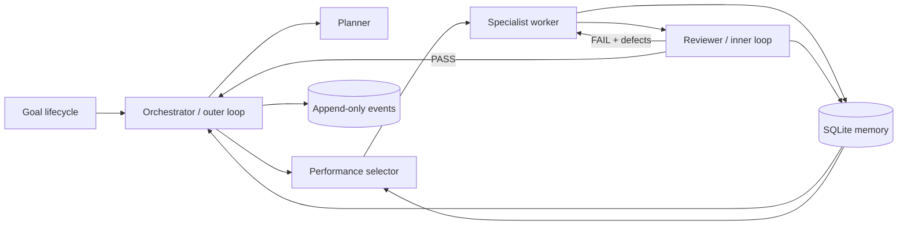

# Agent Society Loop

[简体中文](README.zh-CN.md) | English

An auditable Python runtime for organizing specialized AI agents around a goal. It implements goal lifecycle management, an outer planning loop, an inner execute-review-repair loop, durable memory, and performance-based agent selection.

The default demo is deterministic and needs no API key. You can inspect every task, review, artifact, routing decision, and state transition in SQLite.

## Why this project

Single-agent workflows often mix planning, execution, and evaluation in one opaque prompt. Agent Society Loop separates those responsibilities and makes their contracts observable:

- **One lifecycle:** goals move through explicit planning, running, success, failure, and blocked states.
- **Two loops:** the orchestrator advances the task graph; workers and reviewers repeat until criteria pass or budgets stop the run.
- **Three memories:** task feedback, seed knowledge, and task-specific agent performance persist in SQLite.
- **Four roles:** planner, specialist worker, reviewer, and memory manager communicate through typed interfaces.
- **Bounded autonomy:** retries and total actions are limited, acceptance criteria cannot be silently rewritten, and every decision emits an event.

## Quick start

Requires Python 3.10 or newer.

```bash
git clone https://github.com/woshishadowhunter/agent-society-loop.git
cd agent-society-loop
python -m pip install -e .
agent-society demo --db demo.db
```

Expected result:

```text
Goal quantum-mug-demo: succeeded (4/4 tasks, 1 retries)
```

Inspect what happened:

```bash
agent-society status quantum-mug-demo --db demo.db --json
agent-society events quantum-mug-demo --db demo.db
agent-society agents --db demo.db --json
```

The bundled scenario deliberately produces an incomplete first market report. The reviewer rejects it, the defect enters short-term memory, and the specialist repairs the report on its second attempt.

## Architecture



See [Architecture](docs/architecture.md) for state transitions, module boundaries, selection scoring, persistence, and failure behavior.

## Run your own goal specification

```bash
agent-society run examples/goal-spec.json --db my-goal.db --json
```

A task supplies an initial `output`, optional `repair_output`, dependencies, and structured acceptance criteria. This makes local experiments reproducible before connecting a model provider.

```json
{
  "goal_id": "brief-001",
  "title": "Create an evidence brief",
  "description": "Produce a reviewed artifact",
  "tasks": [
    {
      "task_id": "draft",
      "task_type": "writing",
      "description": "Write the draft",
      "acceptance_criteria": {"required_terms": ["evidence"]},
      "output": "A vague draft",
      "repair_output": "A clear recommendation supported by evidence"
    }
  ]
}
```

The complete format is documented in [Goal specification](docs/goal-spec.md).

## Commands

| Command | Purpose |
| --- | --- |
| `agent-society demo` | Run the offline quantum mug scenario |
| `agent-society run SPEC.json` | Execute a deterministic JSON task graph |
| `agent-society status GOAL_ID` | Inspect goal, tasks, reviews, and artifacts |
| `agent-society events GOAL_ID` | Read the ordered audit trail |
| `agent-society agents` | Inspect agent profiles and performance |
| `agent-society knowledge add` | Add long-term seed knowledge |
| `agent-society knowledge search` | Retrieve relevant seed knowledge |

All commands accept `--db`. Inspection commands and execution reports accept `--json`.

## Connect an OpenAI-compatible provider

The optional provider uses the Python standard library and does not persist or print its API key:

```python
import os

from agent_society_loop.providers import OpenAICompatibleProvider

provider = OpenAICompatibleProvider(
    api_key=os.environ["MODEL_API_KEY"],
    base_url=os.environ.get("MODEL_BASE_URL", "https://api.openai.com/v1"),
    model=os.environ["MODEL_ID"],
)

text = provider.complete([
    {"role": "system", "content": "Return a concise, evidence-based answer."},
    {"role": "user", "content": "Summarize the supplied research."},
])
```

The provider is an integration boundary, not an automatic replacement for the deterministic workers. Implement the `Planner`, `Worker`, or `Reviewer` protocols in `ports.py`, parse model output into the typed contracts, and inject the adapter into `LoopEngine`.

## What self-evolution means here

After each reviewed attempt, the runtime updates performance for `(agent_id, task_type)`. Future routing combines success rate, review score, latency, and sample confidence. The score breakdown is recorded in the event log.

The runtime does **not** rewrite its own source code, prompts, acceptance criteria, or safety policy. That boundary keeps changes reviewable and prevents a weak result from redefining what “good” means.

## Current boundaries

Version 0.1 runs tasks sequentially in one process. It uses tagged lexical retrieval rather than embeddings, and the bundled JSON runner uses deterministic outputs. Distributed workers, provider-backed agent adapters, concurrent scheduling, and a web UI are future extension areas, not current claims.

## Development

```bash
python -m unittest discover -s tests -v
python -m compileall -q src examples
```

Read [CONTRIBUTING.md](CONTRIBUTING.md) before opening a pull request. Security issues should follow [SECURITY.md](SECURITY.md).

## License

MIT. See [LICENSE](LICENSE).

