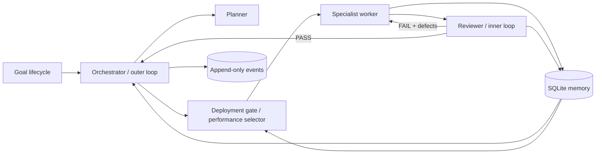

# Agent Society Loop

[简体中文](README.zh-CN.md) | English

An auditable Python runtime for organizing specialized AI agents around a goal. It implements goal lifecycle management, an outer planning loop, an inner execute-review-repair loop, durable memory, and performance-based agent selection.

The default demo is deterministic and needs no API key. You can inspect every task, review, artifact, routing decision, and state transition in SQLite.

## Why this project

Single-agent workflows often mix planning, execution, and evaluation in one opaque prompt. Agent Society Loop separates those responsibilities and makes their contracts observable:

- **One lifecycle:** goals move through explicit planning, running, success, failure, and blocked states.
- **Two loops:** the orchestrator advances the task graph; workers and reviewers repeat until criteria pass or budgets stop the run.
- **Three memories:** task feedback, seed knowledge, and task-specific agent performance persist in SQLite.
- **Four roles:** planner, specialist worker, reviewer, and memory manager communicate through typed interfaces.
- **Bounded autonomy:** retries and total actions are limited, acceptance criteria cannot be silently rewritten, and every decision emits an event.

## Quick start

Requires Python 3.10 or newer.

```bash
git clone https://github.com/woshishadowhunter/agent-society-loop.git
cd agent-society-loop
python -m pip install -e .
agent-society demo --db demo.db
```

Expected result:

```text
Goal quantum-mug-demo: succeeded (4/4 tasks, 1 retries)
```

Inspect what happened:

```bash
agent-society status quantum-mug-demo --db demo.db --json
agent-society events quantum-mug-demo --db demo.db
agent-society agents --db demo.db --json
```

The bundled scenario deliberately produces an incomplete first market report. The reviewer rejects it, the defect enters short-term memory, and the specialist repairs the report on its second attempt.

## Inspect or implement a GitHub issue with real model agents

The default workflow remains read-only. Configure an OpenAI-compatible endpoint and run a reviewed maintenance intake:

```bash
export MODEL_API_KEY="..."
export MODEL_ID="your-model"
agent-society maintain owner/repository 123 --workspace . --db maintain.db --json
agent-society traces maintain-owner-repository-123 --db maintain.db --json
```

Version 0.3 also provides an opt-in guarded execution mode. Checks are configured by the operator and selected by name; the model cannot provide shell text:

```bash
agent-society maintain owner/repository 123 \
  --workspace . --db ../maintain.db --apply \
  --check "tests=python -m unittest discover -s tests -v" --json
```

The run pauses before each content-addressed write and named check. Approve the displayed request with `agent-society approve APPROVAL_ID --by NAME --db ../maintain.db`, then repeat the same `maintain` command to resume. Writes are atomic, stale hashes are rejected, checks are bounded and shell-free, and pre-change content is durably recoverable. A deterministic reviewer gate rejects PASS unless every configured check passed against the current workspace digest. This mode still does not commit, push, or create a pull request.

Version 0.4 can publish the verified result from an allowed feature branch. Keep the database outside the workspace and provide a GitHub token:

```bash
export GITHUB_TOKEN="..."
agent-society maintain owner/repository 123 \
  --workspace . --db ../maintain.db --apply \
  --check "tests=python -m unittest discover -s tests -v" \
  --publish --base main --remote origin --branch-prefix "agent-society/" --json
```

Publication has its own exact approval containing the base HEAD, branch policy, changed paths, workspace digest, checks, title, and final PR body. It stages only goal-owned paths and resumes idempotently through commit, push, and PR creation. It never merges or force-pushes.

## Evaluate and promote agent upgrades

Version 0.5 adds a reproducible champion/challenger gate. Evaluation persists every case result and produces a recommendation; it never changes production routing. Promotion is a separate operator action:

```bash
agent-society evaluate examples/evaluation-spec.json --db evolution.db --json
agent-society evaluations RUN_ID --db evolution.db --json
agent-society promote RUN_ID --by operator --db evolution.db --json
agent-society deployments --db evolution.db --json
```

The default policy requires at least five cases, no critical failure, no pass-rate loss, a mean-score gain, bounded per-case regression, and bounded p95 latency. Agent and model identities are rechecked at promotion. Once deployed, the approved champion is mandatory for that task type; an unavailable champion blocks instead of silently falling back. See [Evaluation and promotion](docs/evaluation.md).

External tools can be adapted from stable MCP `2025-11-25` stdio servers. Discovery is not authority: only tools with an operator-supplied local risk classification are registered, and every adapted call still uses the existing schema, approval, tracing, and budget controls. See [MCP tool integration](docs/mcp.md).

## Architecture



See [Architecture](docs/architecture.md) for state transitions, module boundaries, selection scoring, persistence, and failure behavior.

## Run your own goal specification

```bash
agent-society run examples/goal-spec.json --db my-goal.db --json
```

A task supplies an initial `output`, optional `repair_output`, dependencies, and structured acceptance criteria. This makes local experiments reproducible before connecting a model provider.

```json
{
  "goal_id": "brief-001",
  "title": "Create an evidence brief",
  "description": "Produce a reviewed artifact",
  "tasks": [
    {
      "task_id": "draft",
      "task_type": "writing",
      "description": "Write the draft",
      "acceptance_criteria": {"required_terms": ["evidence"]},
      "output": "A vague draft",
      "repair_output": "A clear recommendation supported by evidence"
    }
  ]
}
```

The complete format is documented in [Goal specification](docs/goal-spec.md).

## Commands

| Command | Purpose |
| --- | --- |
| `agent-society demo` | Run the offline quantum mug scenario |
| `agent-society run SPEC.json` | Execute a deterministic JSON task graph |
| `agent-society status GOAL_ID` | Inspect goal, tasks, reviews, and artifacts |
| `agent-society events GOAL_ID` | Read the ordered audit trail |
| `agent-society agents` | Inspect agent profiles and performance |
| `agent-society evaluate SPEC.json` | Compare a challenger with a reproducible benchmark |
| `agent-society evaluations [RUN_ID]` | Inspect evaluation decisions and raw case outcomes |
| `agent-society promote RUN_ID --by NAME` | Explicitly promote a recommended challenger |
| `agent-society deployments` | Inspect active task-type champions |
| `agent-society maintain OWNER/REPO ISSUE` | Produce a reviewed, read-only maintenance proposal |
| `agent-society maintain ... --apply --check NAME=COMMAND` | Apply approved local changes and run approved named checks |
| `agent-society maintain ... --publish` | Publish a verified allowed branch as an approved pull request |
| `agent-society traces GOAL_ID` | Inspect linked model and tool trace spans |
| `agent-society approvals GOAL_ID` | Inspect pending and resolved tool approvals |
| `agent-society approve APPROVAL_ID` | Approve a paused write or execute tool call |
| `agent-society reject APPROVAL_ID` | Reject a paused write or execute tool call |
| `agent-society knowledge add` | Add long-term seed knowledge |
| `agent-society knowledge search` | Retrieve relevant seed knowledge |

All commands accept `--db`. Inspection commands and execution reports accept `--json`.

## Connect an OpenAI-compatible provider

The optional provider uses the Python standard library and does not persist or print its API key:

```python
import os

from agent_society_loop.providers import OpenAICompatibleProvider

provider = OpenAICompatibleProvider(
    api_key=os.environ["MODEL_API_KEY"],
    base_url=os.environ.get("MODEL_BASE_URL", "https://api.openai.com/v1"),
    model=os.environ["MODEL_ID"],
)

text = provider.complete([
    {"role": "system", "content": "Return a concise, evidence-based answer."},
    {"role": "user", "content": "Summarize the supplied research."},
])
```

Use `ModelPlanner`, `ModelWorker`, and `ModelReviewer` from `model_agents.py` when strict JSON role adapters are appropriate. `ModelWorker` accepts only one structured tool call or final artifact per turn, applies a separate tool-step budget, and delegates every action to the policy-controlled tool runtime.

## What self-evolution means here

After each reviewed attempt, the runtime updates performance for `(agent_id, task_type)`. Task types without an active deployment use success rate, review score, latency, and sample confidence. Agent upgrades can additionally be compared on an immutable benchmark and promoted through an explicit champion/challenger gate.

The runtime never approves its own mutations and does **not** rewrite prompts, acceptance criteria, or safety policy. Guarded maintenance may change the selected workspace only through exact, durable approvals. That boundary keeps changes reviewable and prevents a weak result from redefining what “good” means.

## Current boundaries

Version 0.5 still runs tasks sequentially in one process and uses tagged lexical retrieval rather than embeddings. MCP support is limited to stable stdio tool discovery and calls; it does not include HTTP transport, resources, sampling, elicitation, or experimental tasks. The runtime cannot delete or rename files, install dependencies, merge, force-push, or modify branch protection. Distributed workers, A2A delegation, concurrent scheduling, online learning, and a web console remain future work.

## Development

```bash
python -m unittest discover -s tests -v
python -m compileall -q src examples
```

Read [CONTRIBUTING.md](CONTRIBUTING.md) before opening a pull request. Security issues should follow [SECURITY.md](SECURITY.md).

## License

MIT. See [LICENSE](LICENSE).

