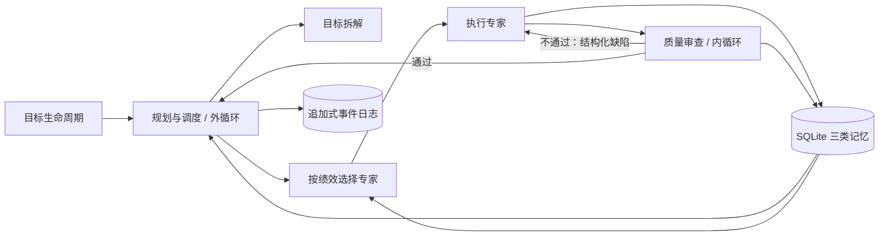

# 智子社会循环（Agent Society Loop）

简体中文 | [English](README.md)

这是一个可审计的 Python 多智能体运行时：围绕一个目标，将规划、专业执行、质量审查和记忆管理拆成清晰角色，通过“外层目标循环 + 内层质检返工循环”持续推进，直到目标成功、失败或因预算停止。

默认演示完全离线，不需要 API Key。目标、任务、产物、质检报告、智能体选择理由和状态变化都会写入 SQLite，方便复盘和验证。

## 解决什么问题

很多 Agent 项目把规划、执行和自我评价塞进一个提示词，结果难以解释、难以恢复，也很难判断所谓“自我进化”是否真实发生。本项目把它工程化为：

- **一个核心：** 目标拥有创建、规划、运行、成功、失败和阻塞状态。
- **两层循环：** 调度器推进任务图；执行者根据质检缺陷反复修正，但受重试次数和总动作预算限制。
- **三种记忆：** 当前任务反馈、长期种子知识、按任务类型统计的智能体绩效。
- **四类角色：** 规划者、执行专家、质检者、记忆管理者通过类型化接口协作。
- **可控进化：** 历史结果影响下一次选人，但系统不能偷偷修改源码、验收标准或安全策略。

## 快速开始

需要 Python 3.10 或更高版本。

```bash
git clone https://github.com/woshishadowhunter/agent-society-loop.git
cd agent-society-loop
python -m pip install -e .
agent-society demo --db demo.db
```

预期结果：

```text
Goal quantum-mug-demo: succeeded (4/4 tasks, 1 retries)
```

查看完整执行证据：

```bash
agent-society status quantum-mug-demo --db demo.db --json
agent-society events quantum-mug-demo --db demo.db
agent-society agents --db demo.db --json
```

内置“量子咖啡杯上市材料”演示会故意让市场分析初稿少一个数据来源。质检 Agent 拒绝初稿，缺陷写入短期记忆，市场分析 Agent 在第二次执行时补齐证据并通过。

## 工作流程



详细模块边界、状态转换、选择公式和故障处理见 [架构文档](docs/architecture.md)。

## 运行自己的目标

```bash
agent-society run examples/goal-spec.json --db my-goal.db --json
```

JSON 文件可以定义目标、任务依赖、初始产出、返工产出和验收标准。例如：

```json
{
  "goal_id": "brief-001",
  "title": "制作证据简报",
  "description": "生成经过审查的简报",
  "tasks": [
    {
      "task_id": "draft",
      "task_type": "writing",
      "description": "撰写初稿",
      "acceptance_criteria": {"required_terms": ["证据"]},
      "output": "一份模糊的初稿",
      "repair_output": "这项建议有调查证据支持"
    }
  ]
}
```

完整字段说明见 [目标规范](docs/goal-spec.md)。

## 用真实模型检查或实施 GitHub Issue

默认工作流仍然只读。配置 OpenAI-compatible 模型后，可以运行一次经过质检的维护分析：

```bash
export MODEL_API_KEY="..."
export MODEL_ID="your-model"
agent-society maintain owner/repository 123 --workspace . --db maintain.db --json
agent-society traces maintain-owner-repository-123 --db maintain.db --json
```

v0.3 还提供显式开启的受控执行模式。验证命令由操作者预先配置，模型只能按名称选择，不能提供 Shell 文本：

```bash
agent-society maintain owner/repository 123 \
  --workspace . --db ../maintain.db --apply \
  --check "tests=python -m unittest discover -s tests -v" --json
```

每次内容寻址写入和命名检查前，目标都会暂停。使用 `agent-society approve APPROVAL_ID --by NAME --db ../maintain.db` 批准后，重复原 `maintain` 命令即可恢复。写入采用原子替换并拒绝过期哈希，检查无 Shell、有限时且限制输出，修改前内容可持久恢复。确定性质检门禁会拒绝缺少验证证据的 PASS，并要求所有检查都在当前工作区摘要上真实通过。这个模式仍不会提交、推送或创建 Pull Request。

## 常用命令

| 命令 | 用途 |
| --- | --- |
| `agent-society demo` | 运行离线量子咖啡杯演示 |
| `agent-society run SPEC.json` | 执行 JSON 任务图 |
| `agent-society status GOAL_ID` | 查看目标、任务、质检和产物 |
| `agent-society events GOAL_ID` | 查看有序审计事件 |
| `agent-society agents` | 查看 Agent 档案和绩效 |
| `agent-society maintain OWNER/REPO ISSUE` | 生成经过质检的只读维护建议 |
| `agent-society maintain ... --apply --check NAME=COMMAND` | 应用获批的本地修改并运行获批的命名检查 |
| `agent-society traces GOAL_ID` | 查看模型与工具的关联 Trace |
| `agent-society approvals GOAL_ID` | 查看待处理及已处理审批 |
| `agent-society approve APPROVAL_ID` | 批准暂停中的写入或执行工具 |
| `agent-society reject APPROVAL_ID` | 拒绝暂停中的写入或执行工具 |
| `agent-society knowledge add` | 添加长期种子知识 |
| `agent-society knowledge search` | 检索长期知识 |

所有命令都支持 `--db` 指定数据库；执行报告和查询命令支持 `--json`。

## 接入真实模型

项目提供不依赖第三方 SDK 的 OpenAI-compatible HTTP 适配器：

```python
import os

from agent_society_loop.providers import OpenAICompatibleProvider

provider = OpenAICompatibleProvider(
    api_key=os.environ["MODEL_API_KEY"],
    base_url=os.environ.get("MODEL_BASE_URL", "https://api.openai.com/v1"),
    model=os.environ["MODEL_ID"],
)
```

需要严格 JSON 角色适配时，可以直接使用 `model_agents.py` 中的 `ModelPlanner`、`ModelWorker` 和 `ModelReviewer`。`ModelWorker` 每轮只接受一次结构化工具请求或最终产物，并使用独立的工具步数预算；所有行动都必须经过受策略控制的工具运行时。API Key 只从运行环境读取，不会写入数据库或日志。

## “自进化”的准确含义

每次经过质检的执行都会更新 `(agent_id, task_type)` 绩效，包括通过率、平均得分、耗时和近期结果。下一次分配同类型任务时，选择器综合这些数据，并把评分明细记录到事件日志。

运行时永远不会自行批准修改，也不会改写提示词、验收标准或安全规则。受控维护只能根据精确且持久化的审批修改指定工作区，避免一次低质量结果反过来降低质量标准。

## 当前边界

v0.3 仍在单进程中顺序执行任务；长期知识采用标签和词项匹配，不是向量数据库。受控维护可以编辑 UTF-8 文本并运行操作者配置的本地检查，但不能删除或重命名文件、安装依赖、提交、推送或创建 Pull Request。分布式队列、并发调度、MCP/A2A 适配器、发布门禁和 Web 控制台仍属于后续工作。

## 开发与验证

```bash
python -m unittest discover -s tests -v
python -m compileall -q src examples
```

贡献代码前请阅读 [CONTRIBUTING.md](CONTRIBUTING.md)，安全问题请按 [SECURITY.md](SECURITY.md) 私下报告。

## 开源协议

MIT，详见 [LICENSE](LICENSE)。

