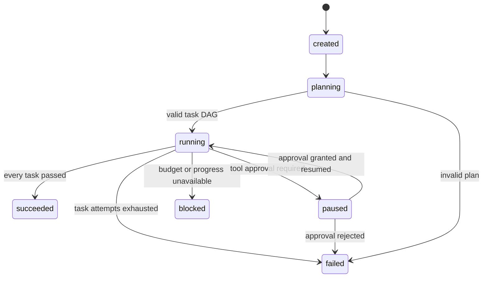
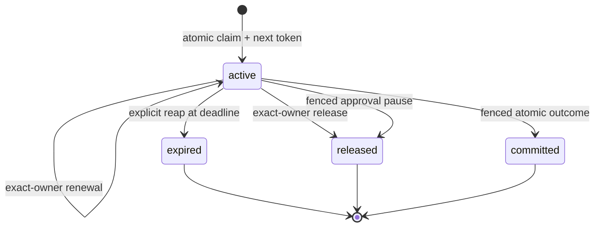

# Architecture

## Design boundary

Agent Society Loop is an auditable orchestration runtime. Its job is to make planning, routing, execution, review, memory, ownership, and stopping conditions explicit. The synchronous engine and complete governance plane use SQLite; the worker execution plane can use either same-host SQLite or multi-host PostgreSQL. Model intelligence remains behind injected protocols.

## Module map

| Module | Responsibility |
| --- | --- |
| `domain.py` | States, immutable data contracts, validation, task DAG checks |
| `ports.py` | Planner, worker, reviewer, model provider, and scheduler repository protocols |
| `storage.py` | SQLite schema and durable repository operations |
| `postgres_storage.py` | PostgreSQL execution-plane schema, queue discovery, and atomic persistence |
| `scheduler.py` | Worker sessions, task claims, lease/fencing contracts, and deterministic safety campaign |
| `worker_service.py` | Claim discovery, independent lease maintenance, execute-review, approval pause, and graceful drain |
| `memory.py` | Context assembly, knowledge retrieval, performance aggregation |
| `experience.py` | Deterministic distillation of reviewed attempts into reusable lessons |
| `evolution.py` | Deterministic parent genome recombination into inactive child candidates |
| `selection.py` | Eligible-agent filtering and explainable ranking |
| `engine.py` | Goal lifecycle, outer loop, inner loop, budgets, resume |
| `deterministic.py` | Reproducible planner, specialists, and criteria reviewer |
| `providers.py` | OpenAI-compatible HTTP boundary |
| `model_agents.py` | Strict JSON planner, worker, and reviewer adapters |
| `http_transport.py` | No-redirect bounded HTTP with wall-clock response deadlines |
| `model_runtime.py` | Secret-free provider/agent configuration and compatibility doctor |
| `tools.py` | Tool discovery, schema validation, policy, and approval enforcement |
| `mcp.py` | Bounded MCP stdio transport, tool discovery, and local risk adaptation |
| `a2a.py` | Pinned Agent Cards, bounded A2A HTTP, durable delegation, and remote workers |
| `a2a_governance.py` | Strict policy/TCK parsing, durable decision evaluation, and readiness doctor |
| `a2a_reliability.py` | Socket-free deterministic A2A fault campaign |
| `evaluation.py` | Immutable benchmark evaluation and champion/challenger gates |
| `tracing.py` | Linked, timed, redacted execution spans |
| `outbox.py` | Lease-owned, idempotency-keyed external side-effect delivery |
| `operations.py` | Bounded health and metrics snapshots |
| `readiness.py` | Product-level install-time readiness checks |
| `github.py` | Bounded read-only GitHub issue retrieval |
| `workspace_tools.py` | Bounded inspection, content-addressed writes, recovery, and named checks |
| `publication.py` | Verification-gated, resumable Git commit, push, and pull-request publication |
| `maintenance.py` | GitHub issue maintenance composition root |
| `cli.py` | Goal execution and operational inspection |

Dependencies point toward domain contracts. The engine knows protocols and persistence services, not provider SDKs.

## Goal state machine



Terminal goals are immutable. An interrupted process normally leaves the goal `running`; `resume` resets any in-flight task to `pending`, emits `task.recovered`, and skips succeeded tasks.

## Outer loop

1. Persist the goal and planning transition.
2. Ask the planner for tasks and reject duplicate IDs, missing dependencies, cross-goal tasks, empty plans, or dependency cycles.
3. Select the lowest-position pending task whose dependencies succeeded.
4. Enforce an active task-type deployment, or rank eligible specialists when no deployment exists.
5. Execute the inner loop attempt.
6. Re-read durable state and continue until a goal reaches a terminal state.

## Inner loop

1. Build context from task data, dependency artifacts, failed reviews, and relevant seed knowledge.
2. Execute the selected specialist.
3. Persist the artifact and structured review.
4. Update task-type-specific social memory.
5. PASS and the configured score threshold complete the task.
6. FAIL schedules a retry with defects in context, unless task attempts or the global action budget are exhausted.

Worker exceptions become score-zero failed reviews. They therefore use the same bounded retry path and remain visible in the audit history.

`WorkerBlocked` is the exception for evidence that cannot be retried safely, such as an ambiguous A2A submission. It records a score-zero attempt and delegation evidence, then moves both task and goal to `blocked` for operator review.

## Agent selection

Candidates must be enabled, match the assigned role, and declare either the exact task type or `*`.

When no deployment exists, A2A profiles are excluded from performance routing. Registration is therefore not production authorization. An active deployment may select one exact A2A `(agent_id, model_id)` where the model ID contains the full pinned card digest; the worker must also be explicitly loaded by the runtime.

An active deployment narrows candidates to one exact `(agent_id, model_id)` champion before ranking. If that identity is disabled, incompatible, missing from the worker runtime, or changed, the goal blocks. Silent fallback would bypass the promotion decision and is therefore forbidden.

```text
score = 0.45 * success_rate
      + 0.35 * normalized_review_score
      + 0.10 * latency_score
      + 0.10 * confidence
```

Cold-start values are neutral: success `0.5`, review `0.5`, latency `0.5`, confidence `0.0`. Confidence reaches `1.0` after ten attempts. Equal scores resolve by `agent_id`, so runs and tests remain reproducible.

## Memory and persistence

- Short-term memory: dependency artifacts and failed review feedback scoped to one goal.
- Long-term memory: titled, tagged text entries ranked by query-term and tag overlap.
- Social memory: aggregate and recent outcomes keyed by agent and task type.
- Seed memory: auditable agent genomes describing role seed, self-model, traits, tool profile, memory profile, risk policy, lineage parents, and generation.
- Experience memory: deterministic success/failure lessons distilled from reviewed attempts and injected into later matching task contexts.
- Recombination memory: child genome candidates with explicit parent lineage, strict risk inheritance, shared tool inheritance, and supporting experience IDs.
- Audit memory: ordered events for goals, planning, selection, attempts, reviews, retries, recovery, and completion.
- Evaluation memory: benchmark digests, per-case outcomes, gate metrics, promotion identity, and active deployments.
- Delegation memory: pinned card identity, durable message and remote task IDs, poll state, normalized result digest, and sanitized terminal category.
- Governance memory: canonical policy digests, task-type activations, imported conformance attestations, and immutable per-attempt ALLOW/DENY decisions.
- Scheduler memory: worker sessions, claim history, lease deadlines, and monotonic task-local fencing tokens.
- Approval memory: pending and resolved guarded tool requests plus linked lifecycle traces.
- Outbox memory: idempotent side-effect intents, attempts, delivery ownership, monotonic tokens, and terminal evidence.

SQLite stores structured values as JSON payloads beside indexed identity and ordering columns. PostgreSQL uses JSONB payloads plus normalized scheduler columns for row locking, ready-task ordering, status, lease expiry, and fencing. A run has one persistence authority; the runtime does not split claims and outcomes across backends.

## Safety properties

- `max_attempts` bounds each task.
- `max_actions` bounds the whole run, including retries across process restarts.
- Review PASS alone is insufficient when its score is below `min_passing_score`.
- Long-term knowledge and review feedback cannot modify budgets or criteria.
- Agent genomes, distilled experience, and recombined child candidates are advisory context only; they do not grant tool permissions or change risk policy, criteria, budgets, deployments, or promotion gates.
- Provider secrets are kept outside persistence and error messages.
- Repository source changes require an exact durable approval; no component can self-approve.
- Read-only tools run immediately; write and execute tools require a durable approval.
- Pending approval pauses the goal without creating a failed attempt or consuming action budget.
- Model and tool spans redact sensitive attributes before persistence.
- Workspace writes require an exact pre-write SHA-256 identity and use atomic replacement.
- Per-goal original content and the latest mutation identities are durable and recoverable.
- Verification commands are operator configured, selected by name, shell-free, timed, and output bounded.
- Verification results are tied to a deterministic digest of goal-owned workspace changes.
- Guarded review rejects model PASS when a required check is missing, failed, or stale.
- Publication stages only goal-owned paths and requires current passing checks plus exact approval.
- Commit, push, and PR creation advance through a durable, idempotent state machine.
- Publication never merges, force-pushes, or deletes branches.
- MCP server commands are operator configured, shell-free, secret-minimized, timed, and message bounded.
- MCP tools without local risk classification are not registered; server hints cannot lower risk.
- Evaluation recommendations never change routing without explicit, identity-checked promotion.
- Deployed task types block when their champion is unavailable rather than falling back.
- A2A requests require exact pinned card, interface, protocol version, skill, and optional tenant identities.
- New production A2A requests require exact deployment, active default-deny policy, fresh passing required attestations, and explicit runtime opt-in.
- Policy decisions are durable before payload construction or network I/O; policy limits can only tighten runtime ceilings.
- A2A sends persist `submitting` first; timeout, connection loss, 5xx, or malformed success becomes terminal `unknown` and is never automatically resent.
- Remote output accepts bounded text and structured data only; local review still decides PASS or FAIL.
- Existing accepted/completed delegations resume using stored authority; current policy changes never trigger a resend.
- Claim acquisition serializes through a short transaction that revalidates worker session, running goal, pending task, and succeeded dependencies.
- One partial unique index permits at most one active claim per task; every replacement receives a larger fencing token.
- Outcome commits revalidate exact live ownership and atomically persist artifact, review, attempt, performance, events, final task state, and terminal claim state.
- A passing `WorkerExecution` can include outbox intents; outcome evidence, task/goal state, claim completion, and those intents commit in one transaction. Failed review never publishes its intents.
- Outbox dispatchers bind one explicit topic, maintain the delivery lease on an independent database connection, and use a monotonic token. Expired delivery may be reclaimed, while stale completion is rejected.
- Webhook dispatch sends an idempotency key and delivery token, rejects redirects and URL credentials, defaults to HTTPS, and can run continuously with graceful signal handling.
- Model and webhook HTTP responses have byte ceilings and wall-clock deadlines, including protection from peers that keep a connection alive with slow-drip data.
- Worker approval pauses atomically persist the request, release ownership, restore the task to pending, pause the goal, and consume no attempt; approval resumes the goal transactionally.
- Expired local work returns to pending, while ambiguous or interrupted remote work blocks rather than replaying an unsafe side effect.
- SQLite WAL scheduler guarantees apply only to processes on one host; PostgreSQL uses row locking with `SKIP LOCKED` for multi-host discovery.
- PostgreSQL v0.10 covers execution-plane and outbox state only; A2A governance, evaluation, publication, and maintenance remain SQLite-only.
- Production worker sessions and claims use the selected database as their time authority; explicit timestamps remain available for deterministic tests and operator recovery.
- Transactional outbox intents share the outcome transaction, but an external receiver must enforce the supplied idempotency key. Direct model, tool, HTTP, and filesystem side effects remain outside repository fencing.
- The synchronous engine fails closed when a goal has an active scheduler claim, so legacy interruption recovery cannot bypass lease ownership.

## Scheduler claim state machine



An expired claim never becomes active again. Recovery changes an eligible running task to pending, then a new claim creates a new identity with a strictly larger token. No database lock is held while a model, tool, or remote agent executes.

## Extension example

Implement a protocol and inject it:

```python
class MyWorker:
    agent_id = "legal-reviewer-v1"

    def execute(self, task, context):
        # Call a model or a deterministic tool, then return artifact text.
        return "reviewed artifact"
```

Register the matching `AgentProfile`, add the worker to the engine's `workers` mapping, and keep acceptance decisions in a separate reviewer.

