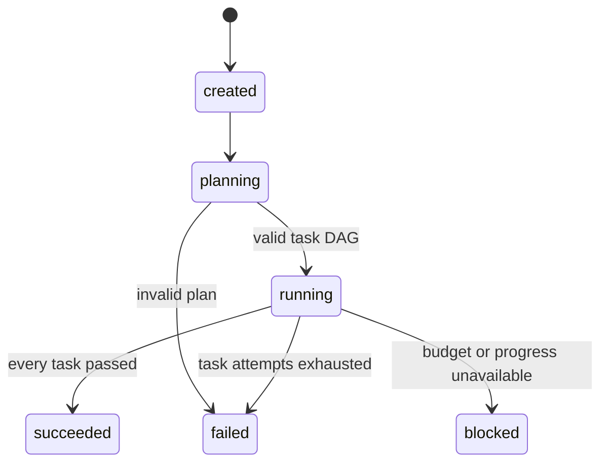

# Architecture

## Design boundary

Agent Society Loop is a local orchestration runtime. Its job is to make planning, routing, execution, review, memory, and stopping conditions explicit. Model intelligence remains behind injected protocols.

## Module map

| Module | Responsibility |
| --- | --- |
| `domain.py` | States, immutable data contracts, validation, task DAG checks |
| `ports.py` | Planner, worker, reviewer, and model provider protocols |
| `storage.py` | SQLite schema and durable repository operations |
| `memory.py` | Context assembly, knowledge retrieval, performance aggregation |
| `selection.py` | Eligible-agent filtering and explainable ranking |
| `engine.py` | Goal lifecycle, outer loop, inner loop, budgets, resume |
| `deterministic.py` | Reproducible planner, specialists, and criteria reviewer |
| `providers.py` | OpenAI-compatible HTTP boundary |
| `cli.py` | Goal execution and operational inspection |

Dependencies point toward domain contracts. The engine knows protocols and persistence services, not provider SDKs.

## Goal state machine



Terminal goals are immutable. An interrupted process normally leaves the goal `running`; `resume` resets any in-flight task to `pending`, emits `task.recovered`, and skips succeeded tasks.

## Outer loop

1. Persist the goal and planning transition.
2. Ask the planner for tasks and reject duplicate IDs, missing dependencies, cross-goal tasks, empty plans, or dependency cycles.
3. Select the lowest-position pending task whose dependencies succeeded.
4. Rank eligible specialists and record the complete decision breakdown.
5. Execute the inner loop attempt.
6. Re-read durable state and continue until a goal reaches a terminal state.

## Inner loop

1. Build context from task data, dependency artifacts, failed reviews, and relevant seed knowledge.
2. Execute the selected specialist.
3. Persist the artifact and structured review.
4. Update task-type-specific social memory.
5. PASS and the configured score threshold complete the task.
6. FAIL schedules a retry with defects in context, unless task attempts or the global action budget are exhausted.

Worker exceptions become score-zero failed reviews. They therefore use the same bounded retry path and remain visible in the audit history.

## Agent selection

Candidates must be enabled, match the assigned role, and declare either the exact task type or `*`.

```text
score = 0.45 * success_rate
      + 0.35 * normalized_review_score
      + 0.10 * latency_score
      + 0.10 * confidence
```

Cold-start values are neutral: success `0.5`, review `0.5`, latency `0.5`, confidence `0.0`. Confidence reaches `1.0` after ten attempts. Equal scores resolve by `agent_id`, so runs and tests remain reproducible.

## Memory and persistence

- Short-term memory: dependency artifacts and failed review feedback scoped to one goal.
- Long-term memory: titled, tagged text entries ranked by query-term and tag overlap.
- Social memory: aggregate and recent outcomes keyed by agent and task type.
- Audit memory: ordered events for goals, planning, selection, attempts, reviews, retries, recovery, and completion.

SQLite stores structured values as JSON payloads beside indexed identity and ordering columns. This keeps the database inspectable while preserving typed Python contracts.

## Safety properties

- `max_attempts` bounds each task.
- `max_actions` bounds the whole run, including retries across process restarts.
- Review PASS alone is insufficient when its score is below `min_passing_score`.
- Long-term knowledge and review feedback cannot modify budgets or criteria.
- Provider secrets are kept outside persistence and error messages.
- No component autonomously modifies repository source code.

## Extension example

Implement a protocol and inject it:

```python
class MyWorker:
    agent_id = "legal-reviewer-v1"

    def execute(self, task, context):
        # Call a model or a deterministic tool, then return artifact text.
        return "reviewed artifact"
```

Register the matching `AgentProfile`, add the worker to the engine's `workers` mapping, and keep acceptance decisions in a separate reviewer.

