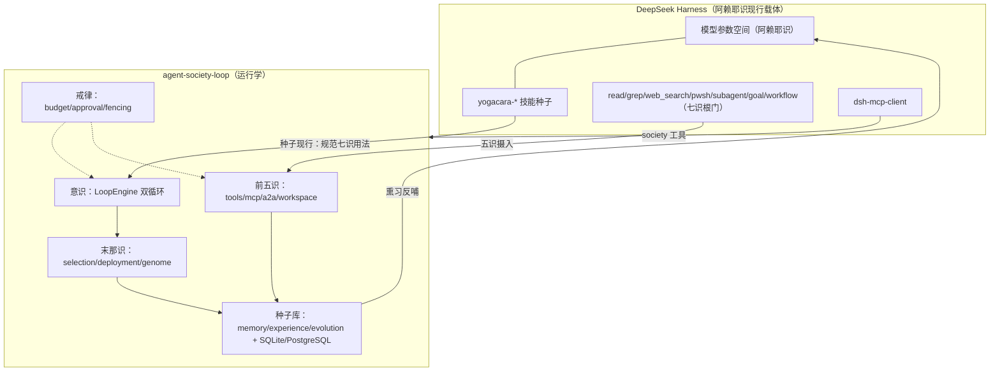

# 唯识论架构总纲：从八识到 Agent Society Loop × DeepSeek Harness

> 本文档是项目的主旨设计文档：说明 agent-society-loop 如何按唯识论（Yogācāra /
> Vijñānavāda）的八识框架展开，以及如何把整套体系拆分为插件、整合进
> DeepSeek Harness（DSH）。
>
> 记忆与学习子系统（神经科学 × 唯识：海马回放/遗忘曲线/RPE × 熏习/异熟）的
> 专项设计见 [`memory-learning-design.md`](memory-learning-design.md)。

## 一、主体理论

人类所谓的智能由两层构成：

1. **阿赖耶识（ālaya-vijñāna，藏识）**：大模型通过参数空间把现实中的概念与语言
   做了空间标记，用向量计算对世界建模——这就是"部分搭建起了阿赖耶识"。但它太
   庞大、表述太丰富，人类使用时无法准确表达自己的思路，**人机交互在这里出现
   断点**。
2. **七识拟合**：所谓 AIGC，就是通过**末那识与眼耳鼻舌身意七识**去完成与人类
   思维的拟合。修行者强调"放下"，而 AIGC 恰恰相反——**用有限的阿赖耶识能力，
   赋予独特的种子（bīja），完成与特定使用者的契合**。

由此得出 harness 的真正作用：

- Agent 的能力与性格**通过文件来约束、不断熏习完善**；
- 这些文件形成的**综合上下文**，就是在准确告知大语言模型"使用者真正的需求"；
- 人类通过**末那识**区别个体、通过**意识**创造与串联、通过**前五识**接收外部
  信息来修正阿赖耶识构建的世界模型。

本项目与 DSH 的整合即按此展开：**DSH 是阿赖耶识的现行载体，agent-society-loop
是七识与种子的运行学，技能文件是植入的种子。**

## 二、八识 → agent-society-loop 组件映射

| 识 | 唯识义 | 项目组件 | 现行作用 |
| --- | --- | --- | --- |
| **阿赖耶识** (8th) | 含藏一切种子、被熏习、生起现行 | 模型参数空间（DeepSeek 模型本身） + `storage.py`/`postgres_storage.py` 的持久化种子库 | 世界模型；一切经验的最终储藏处 |
| **种子/熏习/现行** | 种子生现行、现行熏种子 | `memory.py`（知识+绩效）、`experience.py`（经验蒸馏=熏习）、`evolution.py`（基因组重组=种子相续） | 每次 reviewed attempt 都熏入新种子，未来同类任务接受其现行 |
| **末那识** (7th) | 恒审思量、执藏识为我（我执=个体性） | `domain.AgentProfile`/`AgentGenome`、`selection.py`、`evaluation.py`+`DeploymentRecord` | 区分不同个体；"谁来做"的可审计路由与晋升 |
| **意识** (6th) | 了别、造作、串联诸法 | `engine.LoopEngine`（外循环=规划与串联、内循环=执行-评审-修复）、`deterministic.py`/`model_agents.py` | 把末那识选定的个体与五识摄入的信息串联成有目标的造作 |
| **前五识** (1st-5th) | 根尘相接：眼耳鼻舌身 | `tools.py`（工具门）、`mcp.py`（外部工具）、`workspace_tools.py`（工作区）、`a2a.py`（远程委托）、`providers.py`+`http_transport.py` | 接收外部信息、修正世界模型；详见下表 |

### 前五识细分

| 根 | 识 | 现行（项目工具） | DSH 现行工具 |
| --- | --- | --- | --- |
| 眼 | 视觉 | `WorkspaceReadFileTool`/`WorkspaceListFilesTool`/`WorkspaceSearchTool`（读文件、看图） | `read`、`glob`、`grep`、`read_image`、`modlens_read_image` |
| 耳 | 听觉 | （预留：音频转录工具、A2A 语音输入） | （预留：语音输入通道） |
| 鼻 | 嗅 | 信息嗅探：`GitHubIssueClient`、A2A Agent Card 探测、MCP 工具发现 | `web_search`、`glob` 全树搜索 |
| 舌 | 言语 | 模型输出：`providers.py`、`ModelReviewer` 的评审之言 | 模型回复本身、`ask_user_question` |
| 身 | 造作 | `WorkspaceWriteFileTool`（内容寻址写）、`WorkspaceRunCheckTool`（命名检查）、`publication.py`（发布） | `write`、`edit`、`pwsh`、workflow/subagent 的落地执行 |

### 戒律（śīla）：护栏不是识，是识的边界

唯识修行有戒；Agent Society Loop 的全部安全性质就是它的戒律层，保证七识的造作
不坏种子、不改标准：

- `RunBudget`（max_actions/max_attempts/min_passing_score）——**预算戒**；
- `ToolRisk` + `ApprovalRequest`（读写分离、持久化审批）——**身业戒**；
- `TaskClaim` fencing token（租约围栏、过期提交零写入）——**妄语戒**（不许陈旧
  结果冒充现行）；
- `WorkspaceSnapshot` 内容寻址写 + `VerificationResult` 绑定摘要——**不偷盗戒**
  （不破坏既有内容、不接受未验证 PASS）；
- A2A `DelegationPolicy` 默认拒绝、先决策后联网、歧义不重发——**不妄作戒**；
- genome/experience 只是咨询性种子，不授予权限、不改验收标准——**不坏法戒**。

对应 DSH 侧：sandbox 模式（read-only / workspace-write / danger-full-access）、
文件审批流、budget/超时。

## 三、八识 → DeepSeek Harness 插件映射

DSH 基于 Cordis 插件框架：`@deepseek-ai/dsh-*` 每个包是一个插件。本项目的整合
不修改 DSH 内核，而是用 DSH 原生扩展面实现三层对应：

| DSH 扩展面 | 唯识义 | 本项目产物 |
| --- | --- | --- |
| **Skills**（`dsh-skill` + `dsh-skill-filesystem`，watcher 热加载） | **种子**：文件约束能力与性格，形成综合上下文 | `.agents/skills/yogacara-*` 六个技能种子（见第四节） |
| **MCP 工具**（`dsh-mcp-client`，stdio server） | **前五识根门**：把 society 运行时的根尘接入 DSH | `integrations/dsh/mcp/society_server.py` |
| **Goal/Subagent/Workflow 工具**（`dsh-tool-goal/subagent/workflow`） | **意识与末那识**的 DSH 原生现行 | `yogacara-mano`/`yogacara-manas` 技能中给出的用法规范 |
| **Persona/Presets**（`dsh-persona`、`~/.dsh/.agent-presets`） | **末那识**：使用者的个体性 | 通过 genome 文件与 persona 配置文件互通 |
| **Sessions/Storages**（`~/.dsh/sessions`、`storages`） | **阿赖耶识的储藏** | 每次目标运行以 SQLite 库落盘，可跨会话熏习 |

### 整合后的总拓扑

## 四、种子技能清单（`.agents/skills/yogacara-*`）

每个技能是一个植入 DSH 阿赖耶识的种子：`SKILL.md` frontmatter 的
`name`/`description`/`whenToUse` 是种子的名相，正文是种子的现行条件。

| 技能 | 识 | 种子内容 |
| --- | --- | --- |
| `yogacara-society` | 总纲 | 八识地图、六技能导航、快速开始、个人种子契合工作流 |
| `yogacara-alaya` | 阿赖耶识 | 种子库操作：knowledge/experience/genome/performance；熏习与现行 |
| `yogacara-manas` | 末那识 | 个体性：AgentProfile/selection/deployment/promotion；DSH persona 对应 |
| `yogacara-mano` | 意识 | 双循环引擎、goal 生命周期；DSH goal/subagent/workflow 用法 |
| `yogacara-panca` | 前五识 | 工具门、MCP 适配、A2A 委托；DSH read/pwsh/web_search/vision 对应 |
| `yogacara-sila` | 戒律 | 预算、审批、围栏、默认拒绝；DSH sandbox/审批流对应 |

技能根目录的发现（`dsh-skill-filesystem`，rank 排序）：

1. `<projectRoot>/.dsh/skills`（项目根=最近 `.git` 祖先）
2. `<projectRoot>/.agents/skills` ← **本仓库标准位置**
3. `<dshHome>/skills`（`~/.dsh/skills`，用户级，跨项目可用）
4. `<agentsHome>/skills`（`~/.agents/skills`，通用 agent 约定）

仓库内 `.agents/skills/` 是唯一真源；`integrations/dsh/sync-skills.ps1` 把它镜像
到用户根，保证在任意工作区也能现行。watcher 支持目录热创建，无需重启 DSH。

## 五、MCP 桥（前五识根门的统一出口）

`integrations/dsh/mcp/society_server.py` 是一个零依赖 MCP stdio 服务器，把
society 运行时暴露为 DSH 工具（`mcp__society__*`）：

| MCP 工具 | 识 | 底层 CLI |
| --- | --- | --- |
| `society_run_spec` | 意识 | `agent-society run` |
| `society_enqueue` / `society_worker_run` | 意识+末那 | `enqueue` / `worker run` |
| `society_status` / `society_events` / `society_traces` | 阿赖耶识（回看） | `status` / `events` / `traces` |
| `society_knowledge_add` / `society_knowledge_search` | 种子现行 | `knowledge add` / `search` |
| `society_genome_set` / `society_genome_show` / `society_genome_recombine` | 末那识个体性 | `genome ...` |
| `society_experience_distill` / `society_experience_list` | 熏习 | `experience ...` |
| `society_approve` / `society_reject` | 戒律 | `approve` / `reject` |
| `society_health` / `society_metrics` | 观照 | `health` / `metrics` |

接入方式（需重启 DSH 生效）：在 profile 的 `cordis.patch.yml` 增加
`@deepseek-ai/dsh-mcp-client` 实例，见
`integrations/dsh/cordis.patch.example.yml`。

## 六、个人种子契合工作流（本架构的核心用例）

用户说"通过有限的阿赖耶识能力，赋予独特的种子，来完成与人类使用者的契合"。
落地为四步：

1. **立种子（末那识）**：`agent-society genome set <user-agent> file` 写入角色
   种子、自模型（mission/success_signals/failure_modes）、性格（traits）、工具
   画像、风险政策；
2. **现行（意识+五识）**：在 DSH 中跑 goal（demo/run/enqueue+worker），七识按
   技能种子规范造作；
3. **熏习（阿赖耶识）**：`experience distill` 把 reviewed attempts 蒸馏成
   lessons（成功模式/失败模式），performance 记录反熏路由；
4. **种子相续（进化）**：`genome recombine` 生成子代候选；`evaluate` +
   `promote` 走 champion/challenger 门，绝不静默改换路由。

综合上下文 = 技能种子 + genome 种子 + experience 种子 + knowledge 种子 +
deployment 种子，全部落盘、全部可审计。这正是 harness 告知模型"真正需求"的
方式：不是更长的提示词，而是**有结构、有来源、有边界的种子体系**。

## 七、边界（不坏法）

- DSH 与 agent-society-loop 不互相改写对方的验收标准、预算与安全策略；
- 技能种子只规范用法，不授予权限；权限仍由 DSH sandbox 与 society 审批流决定；
- MCP 桥只暴露读与受控写，不绕过 `ToolRisk` 审批、fencing 与默认拒绝；
- A2A 治理、评估、发布、维护保持 SQLite 单库权威，不与 PostgreSQL 执行平面
  分裂。
